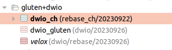
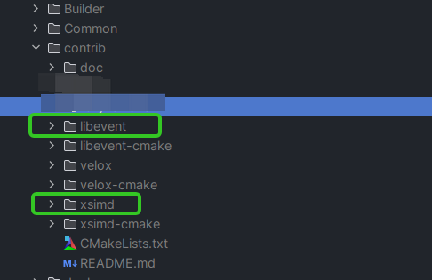
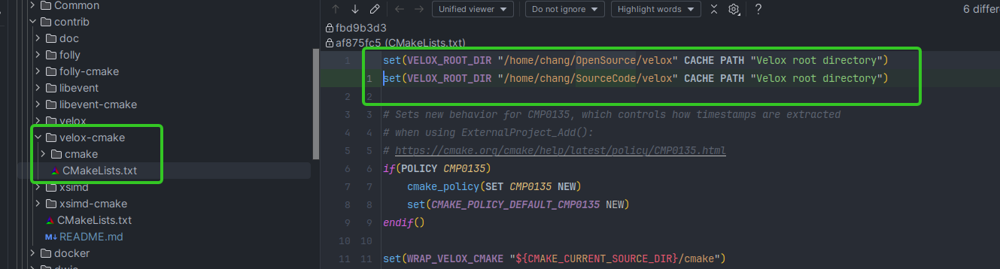

目前需要手工下载：
1. [xsimd](https://github.com/xtensor-stack/xsimd/archive/refs/tags/10.0.0.tar.gz)
2. [libevnet 2.1.11](https://github.com/libevent/libevent/releases/download/release-2.1.11-stable/libevent-2.1.11-stable.tar.gz)
3. `git clone --recursive https://github.com/baibaichen/velox.git` 
   1. 当前分支是 https://github.com/baibaichen/velox/tree/dwio/rebase/20230926
4. gluten: https://github.com/baibaichen/gluten/tree/dwio/20230926
5. ch: https://github.com/Kyligence/ClickHouse/tree/rebase_ch/20230922

| 说明                                                         |                             图例                             |
| ------------------------------------------------------------ | :----------------------------------------------------------: |
| repo 结构                                                    |              |
| **xsimd** 和 **libevent** 手工解压后放到 `cpp-ch/local-engine/contrib` |  |
| velox 需要手工改 cmake，指定你 clone 的目率                  |             |

# TODO

- [x] folly 需要搞成自动化

- [x] 编译配置的说明

  一定要用 OPEN_SSL!!!!

